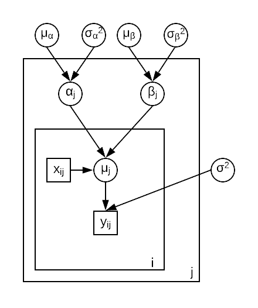
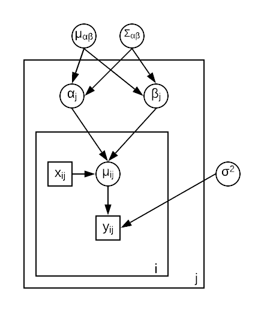
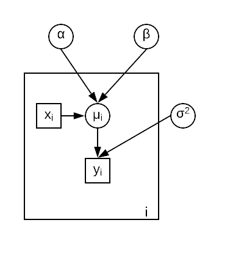

# Introduction 

## Motivation 

An oft-wondered and oft-debated question for people, for as long as the concept of money has existed, is whether having money makes a person happier. While happiness is a tricky thing to quantify, extreme sadness can readily be quantified by looking at the suicide rate for a particular group of people. This brings us to the rather macabre question we have chosen to examine for this project: is there a relationship between average income and the suicide rates for groups of people? 

## The problem and modelling idea
The relationship between the mean income and the suicide rate was modeled as a linear regression problem, and this was done in three different contexts, so that we can try to get some kind of statistically sound answer to the question posed above. The first context is for the 9 different broad groups of professions in the United Kingdom, sourced from the government database for the year 2019. The second is for same, but for 22 groups of professions in the United States. The final context is an international one, the suicide rates were seen for the 93 countries of the world with a population >100k, and the mean incomes for those countries found for the year 2019. In all three cases, the mean income was taken in dollars and standardized by the cost of living for the corresponding country, in order to be able to club such different data together. 

## Prior art 

The US data was examined by the website registerednursing.org, and a single linear trend was fitted with no statistical information or information about the methods. Reviewing past academic publication reveals that similar studies were done with the data in previous years for South Korea [1] and Denmark [2]. The former calculated the suicide hazard ratios for each income bracket to a certain confidence level, while the latter included more factors in the analysis such as age and gender, transforming the problem. 

## Layout of the report

The report commences with explaining the data used for the analysis. After this, the different models that are applied are explained, and then their respective performances are analyzed in terms of convergence and how well they fit the data. Some different priors are hyper priors are tested in a sensitivity analysis, and finally, the results are interpreted with our overall conclusion.

# The data 

Our data was not retrieved from some common source, but rather from different sources and they were adjusted so that they were coherent together.

## United Kingdom data

The data for both the suicide rate (per 100,000 people) and the mean weekly income (which was converted into monthly income, into dollars, and standardized by the cost of living) were both retrieved for the same 9 profession groups from UK Office for National Statistics (ons.gov.uk). The 9 occupation groups selected are 
 

1. Managers, directors and senior officials
2. Professional occupations
3. Associate professional and technical occupations
4. Administrative and secretarial occupations
5. Skilled trades occupations
6. Caring, leisure and other service occupations
7. Sales and customer service occupations
8. Process, plant and machine operatives
9. Unskilled occupations / elementary operations

```{r}
ukdata =read.csv('UKdata.csv');
plot(ukdata$wagepercol, ukdata$suicides100k, xlab='Standardized monthly income', ylab = 'Suicides per 100,000 people', main = 'UK: Suicide Rate vs Monthly Income for different professions')
```

## United States data 

The data for the suicide rate (per 100,000 people) for 22 broad profession groups was retrieved from the Maerican Centre for Disease Control (CDC), and the mean monthly income (which was standardized by the cost of living) was retrieved for the same 22 profession groups from US Bureau of Labor Statistics (BLS). The 22 occupation groups selected are 

|    |                                                            |    |                                                           |
|----|------------------------------------------------------------|----|-----------------------------------------------------------|
| 1  | Management occupations                                     | 12 | Protective service occupations                            |
| 2  | Business and financial operations occupations              | 13 | Food preparation and serving related occupations          |
| 3  | Computer and mathematical occupations                      | 14 | Building and grounds cleaning and maintenance occupations |
| 4  | Architecture and engineering occupations                   | 15 | Personal care and service occupations                     |
| 5  | Life, physical, and social science occupations             | 16 | Sales and related occupations                             |
| 6  | Community and social service occupations                   | 17 | Office and administrative support occupations             |
| 7  | Legal occupations                                          | 18 | Farming, fishing, and forestry occupations                |
| 8  | Educational instruction and library occupations            | 19 | Construction and extraction occupations                   |
| 9  | Arts, design, entertainment, sports, and media occupations | 20 | Installation, maintenance, and repair occupations         |
| 10 | Healthcare practitioners and technical occupations         | 21 | Production occupations                                    |
| 11 | Healthcare support occupations                             | 22 | Transportation and material moving occupations            |


```{r}
usdata =read.csv('USdata.csv');
plot(usdata$wagepercol, usdata$suicides100k, xlab='Standardized monthly income', ylab = 'Suicides per 100,000 people', main = 'US: Suicide Rate vs Monthly Income for different professions')
```


## Global data 
The data for both the suicide rate (per 100,000 people) and the mean monthly income (which was converted into dollars, and standardized by the cost of living of each country) were both retrieved for the 93 countries which have a population greater than 100,000 from the World Population Review website (worldpopulationreview.com). This is quite a different context from the profession-wise data for the countries above, as it is instead countrywise. The standardizing by the cost of living of each country, which was also obtained from the World Population Review website, was our attempt to render the comparison as a fair one. 

```{r}
countrydata =read.csv('countrydata.csv');
plot(countrydata$wagepercol, countrydata$suicides100k, xlab='Standardized monthly income', ylab = 'Suicides per 100,000 people', main = 'Global: Suicide Rate vs Monthly Income for different countries')
```


This is the most complicated context in which this relationship is examined. It must be noted that there are numerous factors contributing to the suicide rates of different countries besides the income standardized by cost of living (Which is similar to the Purchasing Power of the country). In addition to the level of poverty, there are cultural factors (more emphasis on personal happiness, varying sense of familial responsibilities), geographical factors (failing agricultural produce, larger periods of darkness) and several possible other factors (political unrest, war). Therefore the problem in this context is quite simplified, and on cursory viewing of the figure above, it actually appears that there is positive correlation between wealth and income, which on first thought might seem unexpected. 


# Methodology

## Models used 

The standardized monthly income and the suicide rates are modeled together as a linear regression problem, such that the mean of the suicide rate R for a particular income level I would be given by $R = \alpha + \beta I$. The values of $\alpha$ and $\beta$ for this purpose are output through the written Stan codes. For this modeling problem, a few kinds of linear regression models were tested. 

First, hierarchical models are tested. A common $\sigma^2$ is used for all three contexts, with weakly informative priors. The values of $\alpha$ and $\beta$ are drawn from hyperpriors common to all contexts. This is depicted by the first image below.

The second kind of hierarchical model assumes that there is a correlation between $\alpha$ and $\beta$ and therefore the hyperpriors for the two have a vector $\mu$ and a covariance matrix $\Sigma$. Generation of a covariance priors from the hyperpriors requires the separate generation of the correlation matrix $\Sigma_0$ (using the LKJ correlation distribution) and the scaling factor $\sigma_\alpha$ and $\sigma_\beta$. A diagonal matrix D is generated from the two $\sigma$s, and then the covariance matrix is obtained as a transformed parameter as $\Sigma = D\times\Sigma_0\times D$. This model is depicted in the second figure below.

The two hierarchical models explained above are compared with both pooled and separate models, which have priors defined for $\alpha$ and $\beta$ as well as for $\sigma^2$, and also assumes correlation between $\alpha$ and $\beta$. For the pooled model, a single estimate is made for $\alpha$, $\beta$ and for $\sigma^2$ on combining the data from all three contexts. For the separate model, three completely separate estimates are made for each of the contexts for $\alpha$, $\beta$ and for $\sigma^2$. The model layout for both pooled and separate modes look similar, and is depicted as the third figure below. 

{width=200px} {width=200px} {width=200px}


To summarize, the four models tested are: 

- Model 1: Hierarchical model with uncorrelated $\alpha$ and $\beta$ (Figure 1)
- Model 2: Hierarchical model with correlated $\alpha$ and $\beta$. (Figure 2)
- Model 3: Separate model with correlated $\alpha$ and $\beta$. (Figure 3)
- Model 4: Pooled model with correlated $\alpha$ and $\beta$. (Figure 3)

## Stan code 

The Stan code for all of the three models are presented below

Initializing 
```{r echo=T, results='hide', error=FALSE, message=FALSE, warning=FALSE} 
library(loo)
library(rstan)
library(shinystan)

SEED <- 2 # set random seed for reproducability

```
### Model 1: Hierarchical model

```{r} 
file_name1 = "Model_1.stan"
writeLines(readLines(file_name1))

```

### Model 2: Hierarchical model with correlated parameters

```{r} 
file_name2 = "Model_2.stan"
writeLines(readLines(file_name2))

```


### Model 3: Separate model

```{r} 
file_name3 = "Model_3.stan"
writeLines(readLines(file_name3))

```


### Model 4: Pooled model

```{r} 
file_name4 = "Model_4.stan"
writeLines(readLines(file_name4))

```

### Running the models
```{r} 
file_names = c("Model_1.stan", "Model_2.stan", "Model_3.stan")

i=1;
for(file_name in file_names)
{sm_suicide <- rstan::stan_model(file = file_name)

stan_data <- list(y1 = ukdata$suicides100k, x1=ukdata$wagepercol, N1 = length(ukdata$wagepercol), y2 = usdata$suicides100k, x2=usdata$wagepercol, N2 = length(usdata$wagepercol), y3 = countrydata$suicides100k, x3=countrydata$wagepercol, N3 = length(countrydata$wagepercol))
model_hier <- rstan::sampling(sm_suicide, data = stan_data, seed = 2,control=list(adapt_delta=0.95))


draws_hier <- as.data.frame(model_hier)
log_lik  <- data.matrix(draws_hier[(length(draws_hier)-123):(length(draws_hier)-1)]) #Works for all models


loo1 <- loo(log_lik)
loo_vals[i]=loo1$estimates[1];
k_vals[[i]] = max(loo1$diagnostics$pareto_k); 
print(max(loo1$diagnostics$pareto_k)); print(loo1$estimates[1]);
i=i+1;


}
###################4k_vals
model_hier3 = model_hier; 
file_name = "Model_4.stan"

sm_suicide <- rstan::stan_model(file = file_name)

stan_data <- list(y = c(ukdata$suicides100k, usdata$suicides100k, countrydata$suicides100k), x=c(ukdata$wagepercol, usdata$wagepercol, countrydata$wagepercol), N = 124)
model_hier <- rstan::sampling(sm_suicide, data = stan_data, seed = 2,control=list(adapt_delta=0.95))


draws_hier <- as.data.frame(model_hier)
log_lik  <- data.matrix(draws_hier[(length(draws_hier)-123):(length(draws_hier)-1)]) #Works for all models


loo1 <- loo(log_lik)
print(loo1$estimates[1])
loo_vals[i]=loo1$estimates[1];
k_vals[[i]] = max(loo1$diagnostics$pareto_k)
print(max(loo1$diagnostics$pareto_k)); print(loo1$estimates[1])


```


## Sensitivity analysis

### Model 1: Hierarchical model, uncorrelated parameters

|   | Hyper-Priors and priors                                                                                                                                           | Good k-vals | Ok k-vals | Bad k-vals | ELPD-LOO  |
|---|-------------------------------------------------------------------------------------------------------------------------------------------------------|-------------|-----------|------------|-----------|
| 1 | $\mu_\alpha$ ~ normal(10, 100),   $\mu_\beta$ ~ normal(1,100),   sigma_alpha ~ gamma(1, 1),   $\sigma^2_\beta$ ~ gamma(1, 1),  $\sigma$ ~ gamma(1, 1) |         118 |         1 |          4 | -425.0029 |
| 2 | $\mu_\alpha$ ~ normal(0, 10), $\mu_\beta$ ~ normal(0,10), sigma_alpha ~ gamma(1, 1),   $\sigma^2_\beta$ ~ gamma(1, 1),  $\sigma$ ~ gamma(1, 1)        |         122 |         1 |          0 | -425.2139 |
| 3 | $\mu_\alpha$ ~ normal(10, 100), $\mu_\beta$ ~  normal(1,100), sigma_alpha ~ gamma(4, 4),   $\sigma^2_\beta$ ~  gamma(4, 4), $\sigma$ ~ gamma(4, 1)    |         122 |         1 |          0 | -424.6055 |
| 4 | $\mu_\alpha$ ~ normal(0, 10), $\mu_\beta$ ~ normal(0,10), sigma_alpha ~  gamma(4, 4),   $\sigma^2_\beta$ ~ gamma(4, 4), $\sigma$ ~ gamma(4, 4)        |         123 |         0 |          0 | -424.4974 |

### Model 2: Hierarchical model, correlated parameters

|   | Hyper-Priors and priors                                                                                                                                                                 | Good k-vals | Ok k-vals | Bad k-vals | ELPD-LOO  |
|---|------------------------------------------------------------------------------------------------------------------------------------------------------------------------|-------------|-----------|------------|-----------|
| 1 |   $\sigma$ ~ gamma(1,1), $\Sigma_0$ ~ lkj_corr(2),  $\sigma_s$ ~  multi_normal([0,1], [100,10],[10,100]]),  $\mu_\theta$ ~ multi_normal([10,0], [[100,10],[10,100]])   |         122 |         1 |          0 | -423.1688 |
| 2 |   $\sigma$ ~ gamma(4,4), $\Sigma_0$ ~ lkj_corr(0.5),  $\sigma_s$ ~  multi_normal([0,2], [20,10],[10,20]]),  $\mu_\theta$ ~ multi_normal([2,0], [[20,10],[10,20]])      |         114 |         3 |          6 | -425.5915 |
| 3 |   $\sigma$ ~ gamma(2,2), $\Sigma_0$ ~ lkj_corr(0.25),  $\sigma_s$ ~  multi_normal([2,5], [100,10],[10,100]]),  $\mu_\theta$ ~ multi_normal([5,2], [[100,30],[30,100]]) |         122 |         1 |          0 | -423.5076 |
| 4 |   $\sigma$ ~ gamma(1,1), $\Sigma_0$ ~ lkj_corr(0.75),  $\sigma_s$ ~  multi_normal([2,20], [20,10],[10,20]]),  $\mu_\theta$ ~ multi_normal([20,20], [[20,10],[10,20]])  |         123 |         0 |          0 | -422.6902 |


### Model 3: Separate model

|   | Priors                                                                               | Good k-vals | Ok k-vals | Bad k-vals | ELPD-LOO  |
|---|--------------------------------------------------------------------------------------|-------------|-----------|------------|-----------|
| 1 | $\sigma$ ~ gamma(1,1), $\alpha,\beta$ ~ multi_normal([10, 0], [[100,10],[10,100]]);  |         122 |         1 |          0 | -419.4907 |
| 2 | $\sigma$ ~ gamma(4,4), $\alpha,\beta$ ~ multi_normal([50, 2], [[50,20],[20,50]]);    |         122 |         1 |          0 | -439.7526 |
| 3 | $\sigma$ ~ gamma(0.5,0.5), $\alpha,\beta$ ~ multi_normal([5, 2], [[50,10],[10,50]]); |         123 |         0 |          0 | -419.4101 |
| 4 | $\sigma$ ~ gamma(2,2), $\alpha,\beta$ ~ multi_normal([10, 0], [[100,5],[5,100]]);    |         121 |         1 |          1 | -421.8027 |


### Model 4: Pooled model

|   | Priors                                                                               | Good k-vals | Ok k-vals | Bad k-vals | ELPD-LOO  |
|---|--------------------------------------------------------------------------------------|-------------|-----------|------------|-----------|
| 1 | $\sigma$ ~ gamma(1,1), $\alpha,\beta$ ~ multi_normal([10, 0], [[100,10],[10,100]]);  |         122 |         0 |          1 | -530.2663 |
| 2 | $\sigma$ ~ gamma(4,4), $\alpha,\beta$ ~ multi_normal([50, 2], [[50,20],[20,50]]);    |         123 |         0 |          0 | -430.8007 |
| 3 | $\sigma$ ~ gamma(0.5,0.5), $\alpha,\beta$ ~ multi_normal([5, 2], [[50,10],[10,50]]); |         122 |         0 |          1 | -475.4511 |
| 4 | $\sigma$ ~ gamma(2,2), $\alpha,\beta$ ~ multi_normal([10, 0], [[100,5],[5,100]]);    |         122 |         0 |          1 | -531.4167 |


### Analysis
It appears that for the first three models, the sensitivity to the change in prior/hyper-prior is not very high, as the ELPD values don't change very strongly. For the pooled model, the sensitivity is rather higher, varying by upto 100 with the change of prior. 

## Finalized priors + Results 

|         | Hyper-priors/ Priors                                                                                                                                                 | Good k-vals | Ok k-vals | Bad k-vals | ELPD-LOO  |
|---------|----------------------------------------------------------------------------------------------------------------------------------------------------------------------|-------------|-----------|------------|-----------|
| Model 1 | $\mu_\alpha$ ~ normal(0, 10), $\mu_\beta$ ~ normal(0,10), sigma_alpha ~  gamma(4, 4),   $\sigma^2_\beta$ ~ gamma(4, 4), $\sigma$ ~ gamma(4, 4)                       |         123 |         0 |          0 | -424.4974 |
| Model 2 |   $\sigma$ ~ gamma(1,1), $\Sigma_0$ ~ lkj_corr(2),  $\sigma_s$ ~  multi_normal([0,1], [100,10],[10,100]]),  $\mu_\theta$ ~ multi_normal([10,0], [[100,10],[10,100]]) |         122 |         1 |          0 | -423.1688 |
| Model 3 | $\sigma$ ~ gamma(0.5,0.5), $\alpha,\beta$ ~ multi_normal([5, 2], [[50,10],[10,50]]);                                                                                 |         123 |         0 |          0 | -419.4101 |
| Model 4 | $\sigma$ ~ gamma(4,4), $\alpha,\beta$ ~ multi_normal([50, 2], [[50,20],[20,50]]);                                                                                    |         123 |         0 |          0 | -430.8007 |

## Plotting results for the best model 

The best model, accordings to these results is Model 3, with separate models.

```{r} 

list_of_draws <- extract(model_hier3)
mu1 = list_of_draws$mu1;
mu2 = list_of_draws$mu2;
mu3 = list_of_draws$mu3

mu1v = matrix(1:27,ncol=3) 
for (i in c(1:9)){
  mu1v[i,1] = mean(mu1[,i]);
  mu1v[i,2:3] = quantile(mu1[,i], c(0.025, 0.975));
} 

plot(ukdata$wagepercol, ukdata$suicides100k, ylim=c(0,22), main='UK suicide rate', xlab='Standardized income', ylab='Suicides per 100k people');
lines(ukdata$wagepercol, mu1v[,1])
lines(ukdata$wagepercol, mu1v[,2], col='blue')
lines(ukdata$wagepercol, mu1v[,3], col='blue')
```

```{r} 


mu2v = matrix(1:66,ncol=3) 
for (i in c(1:22)){
  mu2v[i,1] = mean(mu2[,i]);
  mu2v[i,2:3] = quantile(mu2[,i], c(0.025, 0.975));
} 

plot(usdata$wagepercol, usdata$suicides100k, main='UK suicide rate', xlab='Standardized income', ylab='Suicides per 100k people')
lines(usdata$wagepercol, mu2v[,1])
lines(usdata$wagepercol, mu2v[,2], col='blue')
lines(usdata$wagepercol, mu2v[,3], col='blue')


```

```{r} 


mu3v = matrix(1:279,ncol=3) 
for (i in c(1:93)){
  mu3v[i,1] = mean(mu3[,i]);
  mu3v[i,2:3] = quantile(mu3[,i], c(0.025, 0.975));
} 

plot(countrydata$wagepercol, countrydata$suicides100k, main='UK suicide rate', xlab='Standardized income', ylab='Suicides per 100k people')
lines(countrydata$wagepercol, mu3v[,1])
lines(countrydata$wagepercol, mu3v[,2], col='blue')
lines(countrydata$wagepercol, mu3v[,3], col='blue')


```


# References: 
[1] Qin, Ping, Esben Agerbo, and Preben Bo Mortensen. "Suicide risk in relation to socioeconomic, demographic, psychiatric, and familial factors: a national register–based study of all suicides in Denmark, 1981–1997." American journal of psychiatry 160.4 (2003): 765-772.

[2] Lee, Sang-Uk, et al. "Suicide rates across income levels: retrospective cohort data on 1 million participants collected between 2003 and 2013 in South Korea." Journal of epidemiology 27.6 (2017): 258-264.

